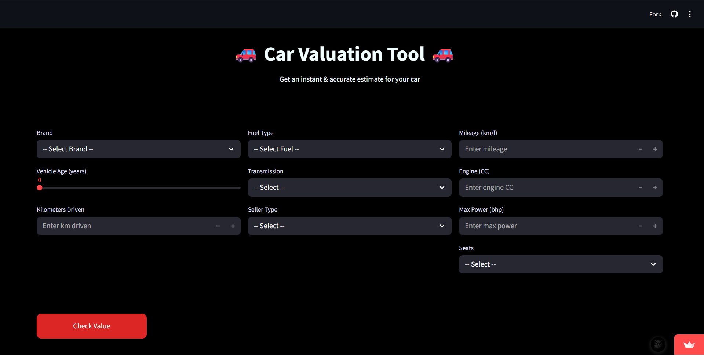
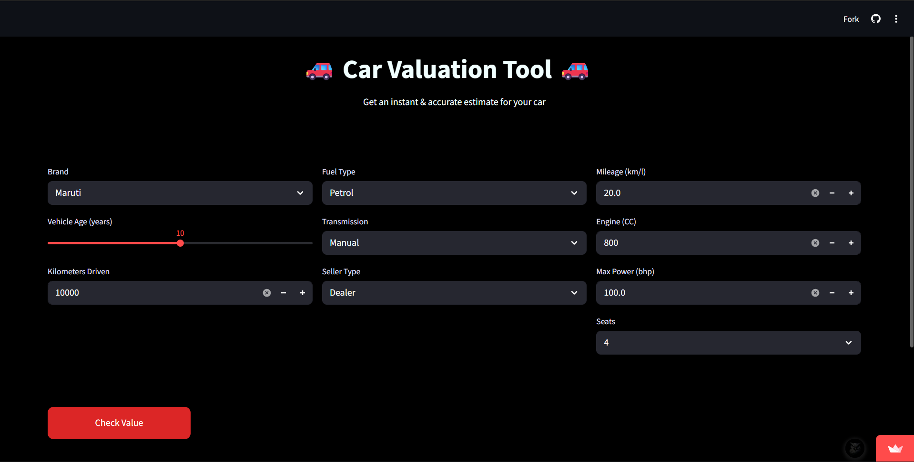
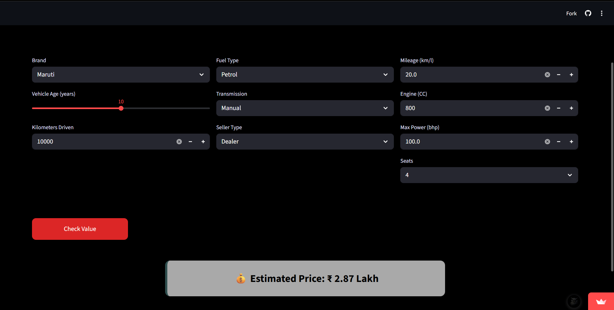

# 🚗 Car Valuation Tool (Used Car Price Prediction)
A machine learning-based web application that predicts the selling price of used cars based on various features such as brand, mileage, engine capacity, and more.

🚀 Live Demo: https://car-valuation-tool-jm.streamlit.app  
📌 Try it here and get instant car price predictions

## 📸 Application Preview
### 🔹 UI of the App

  

### 🔹 Input Example

  

### 🔹 Prediction Output

  

## 📌 Project Overview
The used car market lacks a standardized pricing system, making it difficult for buyers and sellers to determine fair vehicle prices.
This project solves the problem using a data-driven approach by building a machine learning model that predicts car prices based on historical data and key features.

The system provides:
- Accurate price predictions  
- Instant results through a web interface  
- A reliable decision-making tool for buyers and sellers  

## 🎯 Objective
- Predict the selling price of used cars  
- Reduce dependency on manual estimation  
- Build an interactive and user-friendly application  
- Provide real-time price prediction  

## 📊 Dataset
- Dataset: CarDekho Used Car Dataset  
- Source: Kaggle  
- Contains features such as:
  - Brand  
  - Fuel Type  
  - Transmission  
  - Seller Type  
  - Vehicle Age  
  - Kilometers Driven  
  - Mileage  
  - Engine Capacity  
  - Max Power  
  - Number of Seats  

## 🛠️ Technologies Used
- Python  
- Pandas & NumPy  
- Scikit-learn  
- Streamlit  
- Pickle  

## 🤖 Machine Learning Approach
- Model Used: **Random Forest Regressor**  
- Reason:
  - Handles non-linear relationships  
  - Works well with mixed data types  
  - Reduces overfitting
    
The trained model is generated using `train_model.py` and saved as `model.pkl` for use in the application.

### 🔧 Data Processing
- Removed unnecessary columns  
- Log transformation applied on target variable  
- OneHotEncoding for categorical features  

### 📊 Model Performance
- R² Score: ~0.93  
- MAE: ~₹1 Lakh  
- RMSE: ~₹2.2 Lakh  
This indicates strong prediction accuracy on unseen data.  

## ⚙️ System Architecture
1. Data preprocessing  
2. Feature encoding  
3. Model training  
4. Model saving (`model.pkl`, `encoder.pkl`, `columns.pkl`)  
5. User input via UI  
6. Prediction generation  
7. Display result  

## 🌐 Web Application
The project includes a Streamlit-based web application.

### Features:
- Clean and user-friendly interface  
- Multiple input fields:
  - Brand  
  - Fuel Type  
  - Transmission  
  - Seller Type  
  - Vehicle Age  
  - Kilometers Driven  
  - Mileage  
  - Engine  
  - Max Power  
  - Seats  
- Button: Check Value  
- Output: Predicted price in ₹ (Lakh / Crore format)  

The UI and prediction flow are implemented in `app.py`.   
